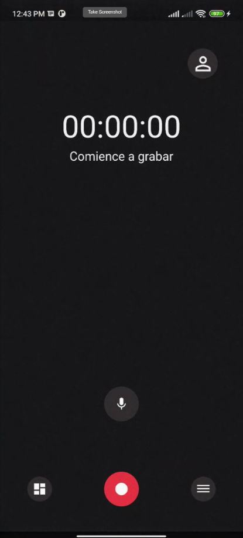
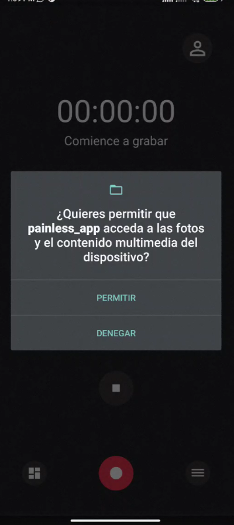
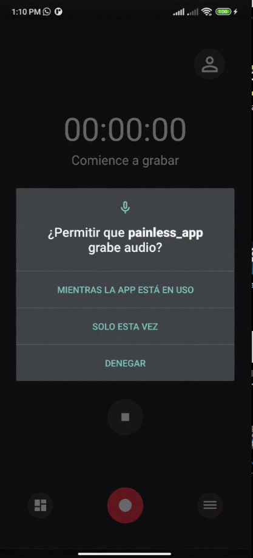
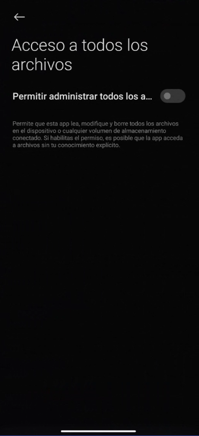
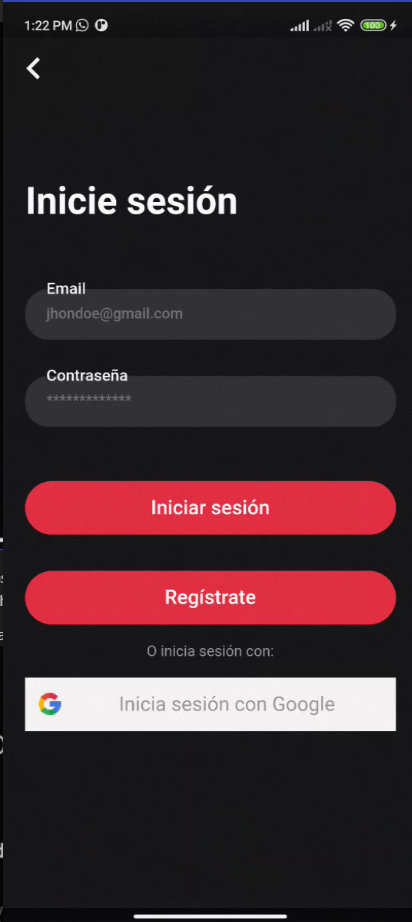
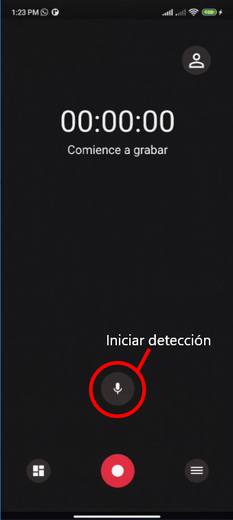
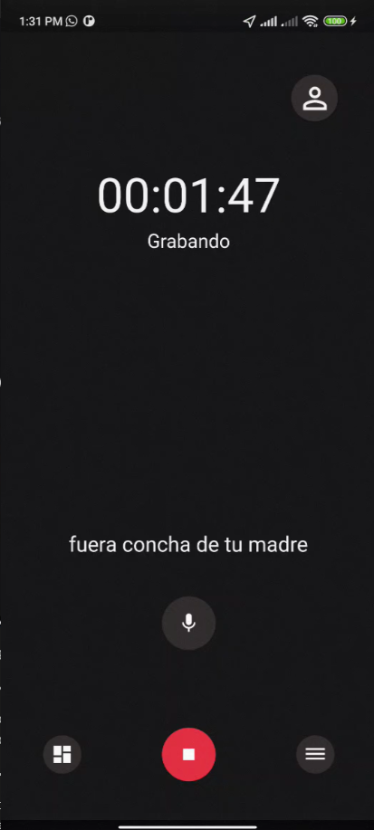
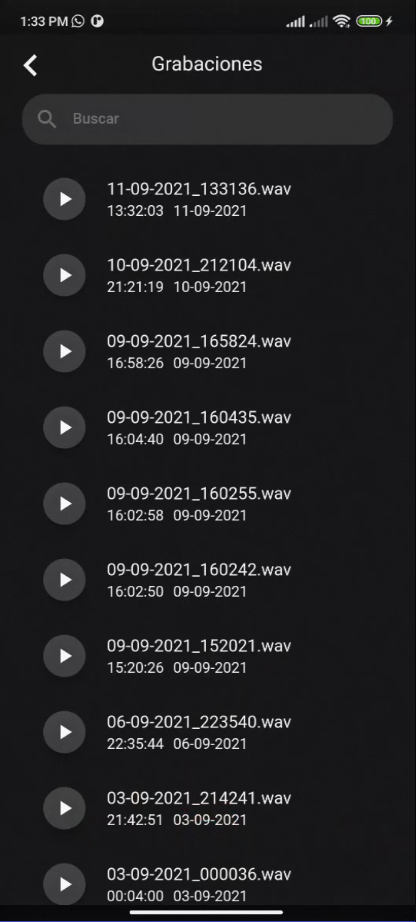
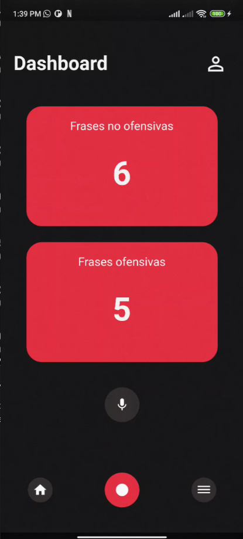

# Aplicación Painless
### Detector de violencia doméstica familiar psicológica por voz
---

## **Introducción**
Esta aplicación fue creada como una herramienta de ayuda y detección de violencia psicológica por voz, para un uso completo siga las siguientes indicaciones.

* Una vez instalada la aplicación es necesaria aceptar el permiso de uso de **almacenamiento interno**, **grabadora** y **ubicación** para que la funcionalidad de la aplicación sea la esperada. 
   
    
    
    
* Una vez aceptado los permisos, diríjase hacia el ícono de inicio de sesión con el ícono usuario 👨‍💼👩‍💼 ubicado en la esquina superior derecha

* Inicie sesión con google o una cuenta existente o regístrese dando un clic sobre el botón ***Regístrate***.
    

* Después puede usar la detección de frases dando clic sobre el botón con el ícono del micrófono, una vez cambie el ícono puede comenzar a hablar y probar.
    

* Si la grabadora comienza a grabar significa que la frase fue detectada como violenta, y a la vez de forma interna envía la ubicación del dispositivo.
    

## **Administrador de grabaciones**
* El ícono ubicado a la derecha del botón rojo te redigirá hacia el administrador de grabaciones en donde puede visualizar y escuchar todas las grabaciones almacenadas.
    

## **Visualizador de clasificaciones**
* El bóton ubicado a la izquierda del botón rojo te redigirá hacia el visualizador de frases clasificadas por tu usuario registrado previamente, ***es importante haber iniciado sesión primero para poder visualizar esta vista***.

    
